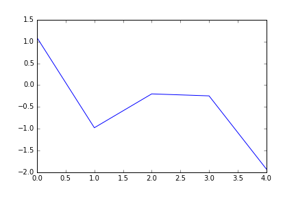
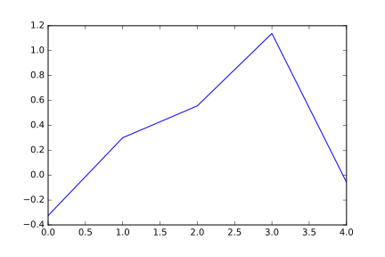

====
Test
====

Created on Fri Apr  8 11:30:07 2016

@author: enrico

can be executed with::

    !python3.5 ../../pmn.py test_plotly.py

Random Data in Text Format
--------------------------

.. raw:: html

    <embed>
    <input type="checkbox" id="cb1"/><label for="cb1">Show Code</label>
    </embed>

.. code:: python

   
   data = [1, 2, 3, 4, 5, 6]
   
   with open('my_output_file.txt', 'w') as outputfile:
       print(data, file=outputfile)
   

.. include:: ./my_output_file.txt
   :literal:

Matplotlib
----------

.. raw:: html

    <embed>
    <input type="checkbox" id="cb3"/><label for="cb3">Show Code</label>
    </embed>

.. code:: python

   import pylab as plt
   
   fig, ax = plt.subplots()
   ax.plot(plt.randn(5))
   fig.savefig("./my_image.png")
   fig.savefig("./my_image.svg")

Images can be included as PNG

Or they can be included as svg

Plot.ly
-------

.. raw:: html

    <embed>
    <input type="checkbox" id="cb5"/><label for="cb5">Show Code</label>
    </embed>

.. code:: python

   
   
   from plotly.offline import plot
   import plotly.graph_objs as go
   
   data = [
       go.Scatter(
           x=[0, 1, 2, 3, 4, 5, 6, 7, 8],
           y=[0, 1, 2, 3, 4, 5, 6, 7, 8]
       )
   ]
   layout = go.Layout(
       autosize=False,
       width=500,
       height=500,
       margin=go.Margin(
           l=50,
           r=50,
           b=100,
           t=100,
           pad=4
       ),
       paper_bgcolor='#7f7f7f',
       plot_bgcolor='#c7c7c7'
   )
   fig = go.Figure(data=data, layout=layout)
   
   plot(fig, filename='./my-graph.html', auto_open=False)
   

.. raw:: html
   :file: ./my-graph.html

Pandas DataFrame Visualization
------------------------------

.. raw:: html

    <embed>
    <input type="checkbox" id="cb9"/><label for="cb9">Show Code</label>
    </embed>

.. code:: python

   
   import pandas as pd
   data = pd.DataFrame(plt.randn(4, 4),
                       index=['Italy', 'France', 'England', 'Spain'],
                       columns=['Cats', 'Dogs', 'Rabbits', 'Giraffes'])
   
   with open('pandas_html_view.html', 'w') as pandas_view:
       print(data.to_html(), file=pandas_view)
   

.. raw:: html
   :file: ./pandas_html_view.html

We could also include ad-hoc decoration by including a piece of css in the html
file that contains the pandas representation! (alonside all the possibilities
given by the base function).

by default the style will be applied to the whole file;
if you want to apply a css only to a specif section, you can include the whole
thing in a div with a specific name, and prefix all the rules of the css with
the name of that div.

.. raw:: html

    <embed>
    <input type="checkbox" id="cb11"/><label for="cb11">Show Code</label>
    </embed>

.. code:: python

   
   with open('pandas_html_view_decorated.html', 'w') as pandas_view:
       # taking the css from
       # http://blog.henryhhammond.com/pandas-formatting-snippets/
       print("""
       
       """, file=pandas_view)
       print("
\n", file=pandas_view)
       print(data.to_html(), file=pandas_view)
       print("
\n", file=pandas_view)
   

.. raw:: html
   :file: ./pandas_html_view_decorated.html

